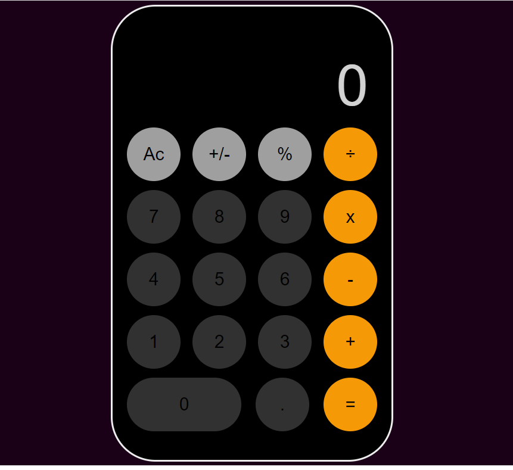

# WEDDING TEMPLATE

## AUTHOR
BOANONG JOSHUA
[@boanong](https://github.com/boanong)

## OVERVIEW
  

## About

This is a calculator design. The project was taken as a learning tutorial to help build my JavaScript skills

## Built With
  this project was built with
- HTML
- CSS
- JavaScript 

### Prerequisites

 You should have Knowledge about:

- GitHub
- HTML
- JavaScript DOM manipulation 

## Clone project

- To get a local copy, follow these simple example steps.
- Clone this repository with `https://github.com/boanong/wedding-template` using your terminal or command-line.

## Command-line steps

- $ `git clone git@github.com:boanong/wedding-template.git`
- $ `cd wedding-template`
- $ `git checkout feature/body`

## Contributing

Contributions, issues, and feature requests are welcome!

Feel free to check the [issues page](https://github.com/boanong/wedding-template/issues).

## 📝 License (optional)

This project is [W3School](./LICENSE) licensed.
